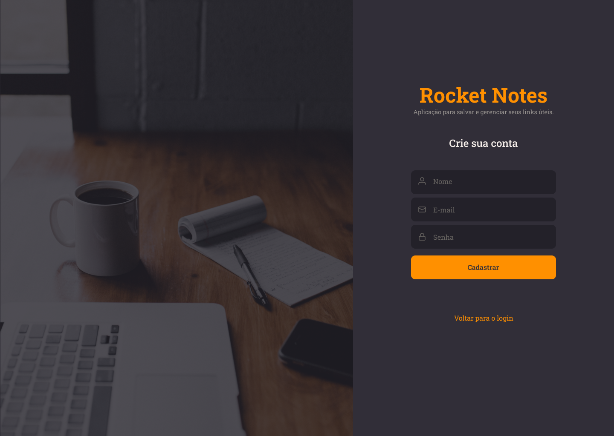
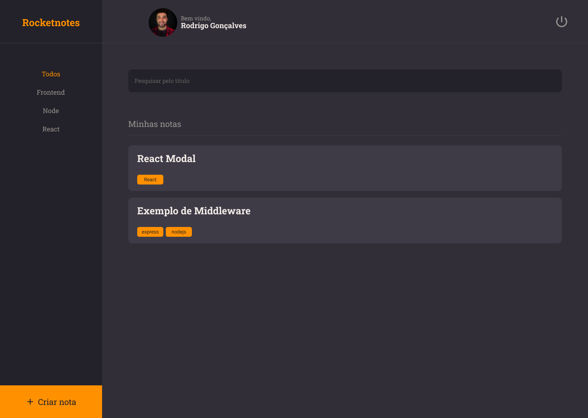
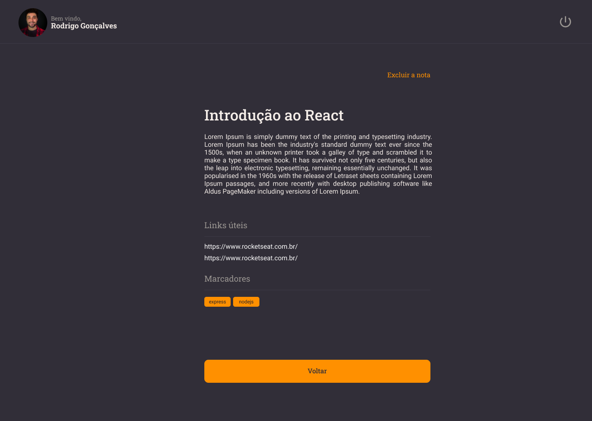

# Rocketnotes

 <p align="center">
    <a href="#-projeto">Projeto</a>&nbsp;&nbsp;&nbsp;|&nbsp;&nbsp;&nbsp;
    <a href="#-tecnologias">Tecnologias</a>&nbsp;&nbsp;&nbsp;|&nbsp;&nbsp;&nbsp;
    <a href="#-como-rodar-projeto">Como rodar projeto</a>&nbsp;&nbsp;&nbsp;|&nbsp;&nbsp;&nbsp;
    <a href="#-licença">Licença</a>
  </p>

   <p align="center">
    
  </p>


## 📋 Projeto

  <p>
    O Rocketnotes e uma aplicação web onde usuários podem se cadastrar para criar anotações de forma organizada, podendo adicionar título, descrição, links e tags, além dessas funcionalidades o usuário pode realizar a atualização do seu perfil, adicionar foto, trocar email, nome é redefinir senha. A aplicação tem um sistema de autenticação.
  </p>

  ## 🎨 Layout 

   
  
  
  
  
  

  ## 👨🏻‍💻 Tecnologias
  
    Abaixo as tecnologias que utilizamos para o desenvolvimento do projeto:

    - ReactJS
    - ViteJS
    - Styled Components
    - Context API
    - React Router Dom
    - Sqlite3
    - Knex
    - JWT - Jsonwebtoken

  </p>

  ## 💿 Como rodar projeto
  
  <p>Para rodar o projeto localmente, precisamos ter o `Node.js` e o `npm` instalados.</p>

  <Strong>Siga o passo a passo:</Strong>

  > git clone
  ```
  $ git clone https://github.com/brunogoncalvesferreira/app-notes.git
  ```

  > Acesse a pasta
  ```
  $ cd app-notes
  ```

  > Instale as dependências
  ```
  $ npm install
  ```

  > Iniciar frontend - Acesse a pasta frontend
  ```
  $ cd frontend
  $ npm run dev
  ```
  > Iniciar backend - Acesse a pasta api
  ```
  $ cd api
  $ npm run dev:server
  ```

  Projeto está rodando na porta http://localhost:3000/

  ## 📝 Licença
 
  Este projeto está licenciado com a licença [MIT](https://github.com/brunogoncalvesferreira/app-notes/blob/main/LICENSE).

  <h2>🙋🏻‍♂️ Entre em contato<h2>
  <div style="display: flex;">
    <a href="https://www.linkedin.com/in/bruno-goncalves-ferreira/" target="_blank"></a>
    <a href="mailto:brunogoncalveferreira@outlook.com"></a> 
    <a href="https://www.instagram.com/brunogonferreira/" target="_blank"></a>
  </div>